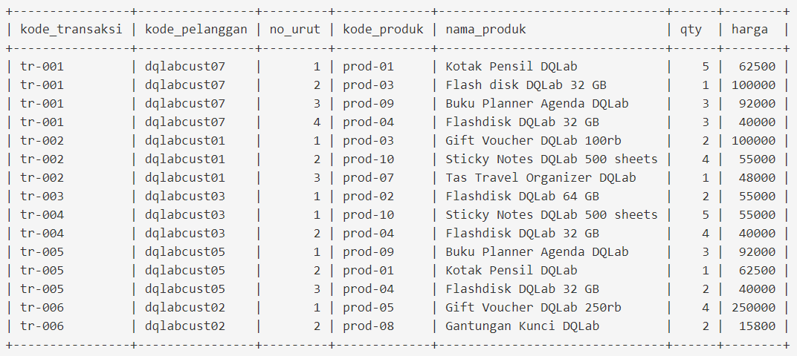

# Proyek dari Cabang A

“Jadi, apakah kamu bisa menyiapkan data transaksi penjualan dengan total revenue >= IDR 100.000?

Format datanya yang akan kamu tampilkan adalah: **kode_pelanggan**, **nama_produk**, **qty**, **harga**, dan **total**, serta diurutkan mulai dari total revenue terbesar,” pinta Senja padaku.

Kalau kasusnya seperti ini, berarti aku perlu meng-query data tersebut dari tabel **tr_penjualan** yang terdapat di database perusahaan.

Aku dapat melakukan

- perkalian antara kolom qty dan harga untuk memperoleh total revenue setiap kode pelanggan yang dinyatakan ke dalam kolom total, dan 
- menggunakan “ORDER BY total DESC” pada akhir query untuk mengurutkan data.

