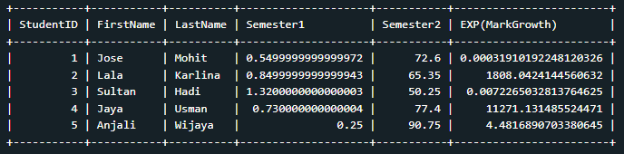

## Fungsi Skalar Matematika

Fungsi skalar untuk numerik value merupakan Fungsi yang umumnya digunakan jika kita ingin melakukan operasi matematika di SQL secara cepat dan efektif. Di SQL sendiri ada banyak fungsi matematika.<br>

- [Dokumentasi Fungsi SQL Postgresql](https://www.postgresql.org/docs/9.5/functions-math.html)
- [Dokumentasi Fungsi SQL MySQL](https://dev.mysql.com/doc/refman/8.0/en/mathematical-functions.html)<br>

<p align="center">

</p>

## Tugas Praktek

Gunakan fungsi **MOD()** untuk menghitung nilai sisa jika nilai Semester1 dibagi 2 dan fungsi **EXP()** untuk menghitung nilai eksponensial dari nilai MarkGrowth. Gunakan kedua fungsi tersebut dalam satu SELECT-Statement.<br>
Jika berhasil, berikut output tabel yang diperoleh:
<p align="center">

</p>
## Solusi Jawaban

```
SELECT StudentID, FirstName, LastName, MOD(Semester1,2) as Semester1, Semester2, EXP(MarkGrowth)
From students;
```
<p align="center">

</p>

