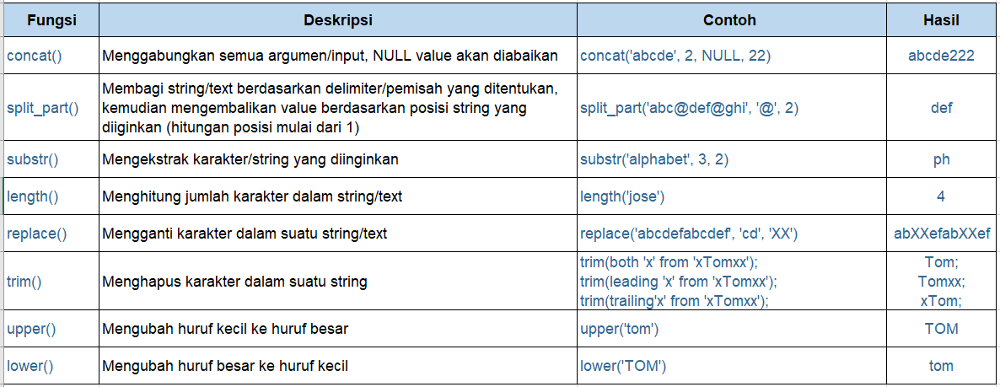

## Fungsi Skalar Text

Fungsi skalar untuk text/string value merupakan fungsi yang digunakan jika kita ingin melakukan operasi pada text atau karakter di SQL, misalnya, mengubah huruf kecil ke huruf besar, menghitung jumlah karakter dari text, dll. Fungsi skalar text di SQL juga cukup banyak. 

- [Dokumentasi Fungsi Skalar Text di Postgresql](https://www.postgresql.org/docs/9.1/functions-string.html)
- [Dokumentasi Fungsi Skalar Text di MySQL](https://dev.mysql.com/doc/refman/8.0/en/string-functions.html) 

