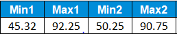
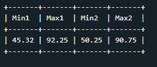

## Fungsi Aggregate

Fungsi aggregate ini digunakan untuk melakukan perhitungan pada sekelompok nilai. Biar lebih jelas kita akan mempraktikkan penggunaan fungsi aggregate di SQL dengan menggunakan fungsi - fungsi aggregate yang umum digunakan.<br>


## Tugas Praktek 1

Setelah memahami fungsi-fungsi sebelumnya, kali ini Senja memintaku untuk menggunakan fungsi **MIN()** dan **MAX()** untuk menghitung nilai dari kolom **Semester1** dan **Semester2**. Aku menggunakan fungsi tersebut dalam satu SELECT-Statement.<br>

Jika berhasil, berikut output tabel yang diperoleh:<br>


## Solusi Jawaban 1

```
SELECT MIN(Semester1) AS Min1, MAX(Semester1) AS Max1 , MIN(Semester2) AS Min2, MAX(Semester2) AS Max2 FROM students;
```


