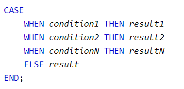
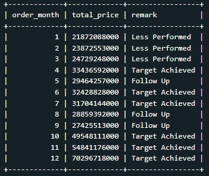

## Fungsi Aggregate

Fungsi aggregate ini digunakan untuk melakukan perhitungan pada sekelompok nilai. Biar lebih jelas kita akan mempraktikkan penggunaan fungsi aggregate di SQL dengan menggunakan fungsi - fungsi aggregate yang umum digunakan.<br>


## Tugas Praktek 1

Setelah memahami fungsi-fungsi sebelumnya, kali ini Senja memintaku untuk menggunakan fungsi **MIN()** dan **MAX()** untuk menghitung nilai dari kolom **Semester1** dan **Semester2**. Aku menggunakan fungsi tersebut dalam satu SELECT-Statement.<br>

Jika berhasil, berikut output tabel yang diperoleh:<br>


## Solusi Jawaban 1

```
SELECT MIN(Semester1) AS Min1, MAX(Semester1) AS Max1 , MIN(Semester2) AS Min2, MAX(Semester2) AS Max2 FROM students;
```


## Fungsi GROUP BY

Untuk mengelompokkan data di SQL kita menggunakan GROUP BY Statement. GROUP BY statement akan mengelompokkan data yang bernilai sama ke dalam satu group, dan dengan menggunakan fungsi aggregate seperti (COUNT, MAX, MIN, SUM, AVG) kita bisa melakukan agregasi untuk untuk setiap group atau kelompok yang terbentuk<br>

<br>
Hal penting yang perlu diperhatikan adalah:<br>

1. GROUP BY digunakan dengan SELECT, artinya kolom yang digunakan di GROUP BY statement, juga perlu ditempatkan di SELECT.
2. GROUP BY ditempatkan setelah WHERE, tetapi jika tidak menggunakan WHERE maka langsung ditempatkan setelah FROM.
3. Jika menggunakan ORDER BY, maka GROUP BY ditempatkan sebelum ORDER BY.

Group by bisa dilakukan dengan single column ataupun multiple column. Seperti ini contohnya:<br>

- Group by Single Column, data dikelompokkan menggunakan kriteria dari satu kolom saja, misalnya mengelompokkan data berdasarkan provinsi saja.
- Group by Multiple Column, data dikelompokkan menggunakan kriteria dari dua kolom atau lebih, misalnya mengelompokkan data berdasarkan province dan brand.

## Fungsi CASE … WHEN…

> Kalau aku diminta untuk menambahkan kolom rekomendasi atau remark dari hasil agregasi data, misalnya nilai penjualan bulan Maret 2019 lebih dari 30M, maka diberikan rekomendasi/remark “Target Achieved”, kalau kurang diberi remark “Follow Up”. Bagaimana melakukannya di SQL ya?

Itu mudah saja Itu bisa kamu lakukan dengan CASE - statement di SQL. CASE - statement ini sama dengan IF - THEN - ELSE di pemrograman pada umumnya. Syntax dari CASE – statement seperti ini. Coba lihat.<br>

<br>
CASE - Statement ditempatkan sesudah SELECT, berikut syntax-nya secara lengkap:<br>

```
SELECT ColumnName1, ColumnName2,
CASE
    WHEN condition1 THEN result1
    WHEN condition2 THEN result2
    WHEN conditionN THEN resultN
    ELSE result
END as alias
FROM TableName;
```

CASE-statement akan mengevaluasi kondisi yang sudah ditentukan, dimulai dari _condition1_, dan akan mengembalikan hasil (_result1_), jika _condition1_ terpenuhi (TRUE). Jika tidak, maka _condition2_ akan dievaluasi, dan akan mengembalikan _result2_ jika _condition2_ terpenuhi, dst. Apabila tidak ada kondisi yang terpenuhi, maka _result_ pada bagian ELSE yang akan dikembalikan.

## Tugas Praktek 2

Dengan menggunakan data **sales_retail_2019**, buatlah syntax query yang menggunakan fungsi skalar **MONTH()** untuk mengubah **order_date** dari tanggal ke bulan, fungsi aggregate **SUM()** untuk menjumlahkan **kolom item_price**.

Tambahkan kolom **remark** menggunakan **CASE… WHEN…** statement. Jika **sum(item_price) >= 30.000.000.000**, maka remark-nya **'Target Achieved'**; Jika **sum(item_price) <= 25.000.000.000** maka remark-nya **'Less performed'**; Selain itu, beri remark **'Follow Up'**.<br>

Jika berhasil, berikut output tabel yang diperoleh:<br>


## Solusi Jawaban 2

```
SELECT MONTH(order_date) AS order_month, SUM(item_price) AS total_price,
CASE
    WHEN SUM(item_price) >= 30000000000 THEN 'Target Achieved'
    WHEN SUM(item_price) <= 25000000000 THEN 'Less Performed'
    ELSE 'Follow Up'
END as remark
FROM sales_retail_2019
GROUP BY order_month;
```


