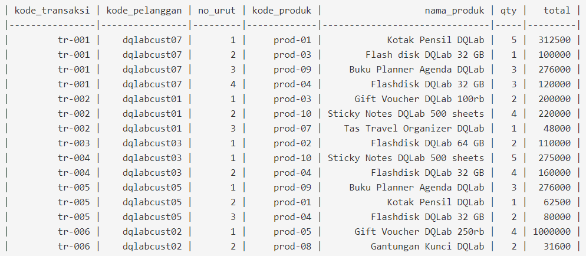
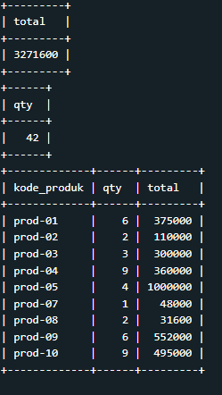
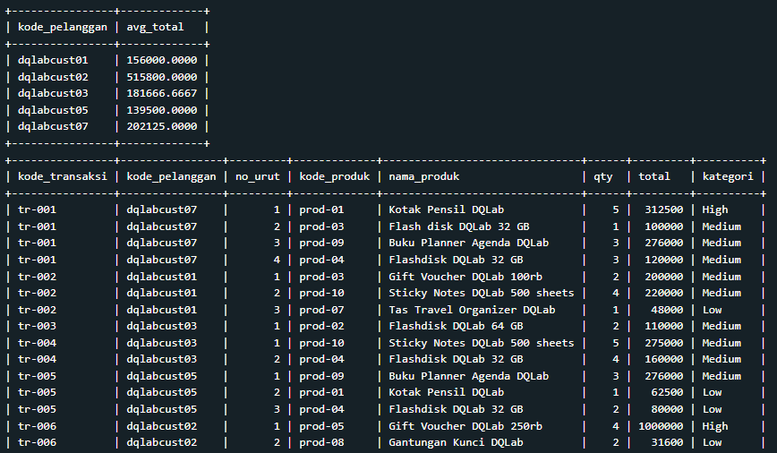

# Proyek Pekerjaan - Analisis Penjualan Part 1

Aku pun membuka email proyek dari Senja sambil menyeruput boba milk tea favoritku.<br>

Aksara, saya senang dengan perkembanganmu belakangan ini. Saya mau minta tolong agar kamu melakukan analisis penjualan di suatu store. Adapun laporan yang diminta sebagai berikut:<br>

1. Total jumlah seluruh penjualan (total/revenue).
2. Total quantity seluruh produk yang terjual.
3. Total quantity dan total revenue untuk setiap kode produk.<br>

**Tabel**: tr_penjualan

<p align="center">

</p>
## Solusi Jawaban

#### 1. Total jumlah seluruh penjualan (total/revenue).

```
SELECT SUM(total) as total
FROM tr_penjualan;
```

#### 2. Total quantity seluruh produk yang terjual.

```
SELECT SUM(qty) as qty
FROM tr_penjualan;
```

#### 3. Total quantity dan total revenue untuk setiap kode produk.

```
SELECT kode_produk, SUM(qty) as qty, SUM(total) as total
FROM tr_penjualan
GROUP BY kode_produk;
```

Output Tabel Jawaban:<br>

<p align="center">

</p>

# Proyek Pekerjaan - Analisis Penjualan Part 2

**_(lanjutan ...)_**

Saya mau minta tolong agar kamu melakukan analisis penjualan di suatu store. Adapun laporan yang diminta sebagai berikut:<br>

4. Rata - Rata total belanja per kode pelanggan.
5. Selain itu, jangan lupa untuk menambahkan kolom baru dengan nama ‘kategori’ yang mengkategorikan total/revenue ke dalam 3 kategori: High: > 300K; Medium: 100K - 300K; Low: <100K.

**Tabel**: tr_penjualan

<p align="center">

</p>

## Solusi Jawaban

#### 4. Rata - Rata total belanja per kode pelanggan.

```
SELECT kode_pelanggan, AVG(total) as avg_total
FROM tr_penjualan
GROUP BY kode_pelanggan;
```

#### 5. Selain itu, jangan lupa untuk menambahkan kolom baru dengan nama ‘kategori’ yang mengkategorikan total/revenue ke dalam 3 kategori: High: > 300K; Medium: 100K - 300K; Low: <100K.

```
SELECT kode_transaksi,kode_pelanggan,no_urut,kode_produk, nama_produk, qty, total,
CASE
    WHEN total > 300000 THEN 'High'
    WHEN total < 100000 THEN 'Low'
    ELSE 'Medium'
END as kategori
FROM tr_penjualan;
```

Output Tabel Jawaban:<br>

<p align="center">

</p>
