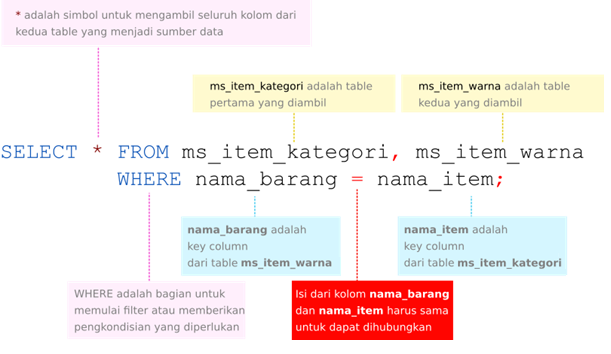
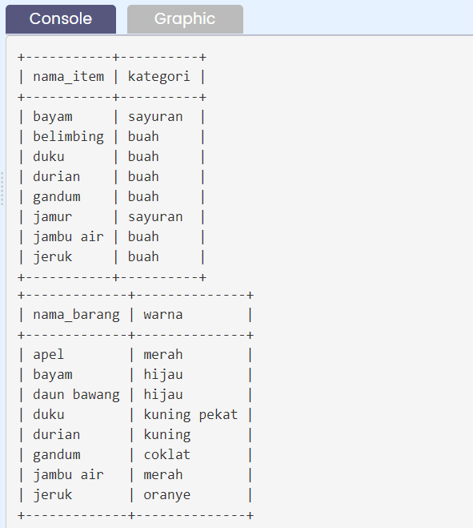
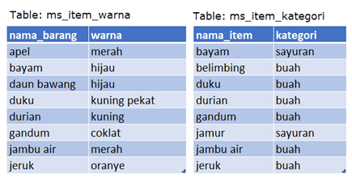
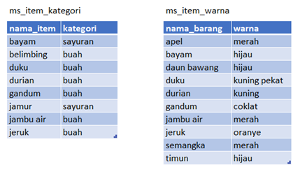

# Penjelasan Query Penggabungan Tabel

Penggabungan dua tabel menjadi satu tabel baru menggunakan query SELECT pada subbab sebelumnya dilakukan dengan cara berikut:<br>

- menuliskan dua nama tabel yang akan digunakan dengan dipisahkan operator koma (,).
- menuliskan pasangan key columns dengan penghubung operator sama dengan (=) di bagian filter atau kondisi.<br>

Berikut adalah gambaran detil syntax penggunaan cara di atas:<br>
<p align="center">

</p>
Cara join seperti ini disebut dengan cara join menggunakan **operator koma**. <br>

# Kesimpulan

Bahasa SQL diciptakan untuk sistem database relasional atau RDBMS. Dan aspek **relasional** inilah yang menjadi fitur paling penting dan unggul, dimana beberapa tabel dapat digabungkan menjadi satu sumber data baru.<br>

Cara menggabungkan antar tabel disebut sebagai mekanisme join. Pada bab ini telah dicontohkan bagaimana dua tipe join, yaitu **inner join** dan **cross join** diterapkan dengan dua contoh tabel sederhana.<br>

**Inner join** terjadi jika kedua tabel digabungkan melalui kolom kunci atau key column. Syarat penggabungan adalah dimana Isi data dari key column tabel yang satu harus dapat dicocokkan dengan isi data dari key column tabel yang lain.<br>

Sedangkan **cross join** terjadi dari penggabungan tabel tanpa kondisi, dan menghasilkan seluruh penggabungan data seperti proses perkalian.<br>

Untuk bab ini, inner join maupun cross join dilakukan dengan cara menggunakan operator koma dan pengkondisian where. Pada bab selanjutnya, akan terlihat penggunaan inner join dengan menggunakan keyword **INNER JOIN … ON**.

# Tugas Praktek

Cobalah ketik query pada code editor untuk melihat keseluruhan isi dari kolom tabel ms_item_kategori dan ms_item_warna.<br>

Jika berjalan dengan benar query-nya dan kemudian berjalan dengan lancar maka akan mendapatkan hasil berikut:<br>

<p align="center">

</p>

## Solusi Jawaban

```
SELECT * FROM ms_item_kategori;

SELECT * FROM ms_item_warna;
```

# Quiz 1

#### Mana kolom dari kedua tabel yang memiliki kecocokan data?

Hal pertama yang perlu dilakukan sebelum menggabungkan kedua tabel adalah **mengidentifikasi kolom mana dari kedua tabel yang memiliki kecocokan atau memiliki informasi yang sama**. Coba kita perhatikan data dari kedua tabel **ms_item_warna** dan **ms_item_kategori** berikut<br>

<p align="center">

</p>
Dari kedua tabel yang tersebut, manakah kolom – kolom yang sebenarnya memiliki kecocokan/kesamaan data sehingga bisa digunakan untuk menghubungkan/menggabungkan kedua tabel?

#### Solusi Jawaban

- nama_barang dan kategori
- **_nama_barang dan nama_item_**
- nama_item dan warna
- warna dan kategori

# Quiz 2

#### Mana data dari pasangan key column yang cocok?

“Saya bantu jelaskan ya agar ke depannya lebih paham, Aksara. Nah, ini kuis selanjutnya mengenai key column. Kolom – kolom yang memiliki kesamaan data dari kedua tabel adalah kolom **nama_barang** dan **nama_item**. Jadi, jika kamu berhasil mengidentifikasi bahwa kedua kolom inilah yang memiliki kecocokan dan kesamaan, maka jawabanmu sangat tepat,” ujar Senja.

Aku mencatat dengan cepat beberapa poin pemaparannya.

“Selanjutnya, perhatikan kedua tabel ini kembali.” Aku mengarahkan pandang pada layar laptop yang ditunjuk Senja.<br>

<p align="center">

</p><br>

Nah, sekarang coba dilihat, mana saja isi data di atas yang terdapat pada kedua table?

#### Solusi Jawaban

- apel
- daun bawang
- belimbing
- **_bayam_**

# Quiz 3

#### Mana Query Penggabungan Tabel Yang Benar?

Mana dari syntax query berikut yang menggabungkan tabel dengan operator koma?

#### Solusi Jawaban

- SELECT \* FROM A & B where A.kolom1 = B.kolom2
- SELECT \* FROM A, B where A.kolom1 equal to B.kolom2
- SELECT \* FROM A and B where A.kolom1 = B.kolom2
- **_SELECT \* FROM A, B where kolom1 = kolom2_**

# Quiz 4

#### Mana Penjelasan Hasil Penggabungan Yang Benar?

Mana dari penjelasan berikut ini yang benar untuk query di bawah ini.
<p align="center">

</p>

#### Solusi Jawaban

- tabel nama_barang dan nama_item dapat digabungkan melalui pasangan key column ms_item_kategori dan ms_item_warna
- **_tabel ms_item_kategori dan ms_item_warna dapat digabungkan jika kondisi isi pada kolom nama_barang sesuai dengan isi pada kolom nama_item._**
- Jika tidak ada isi yang sama di kedua tabel maka data dari kedua tabel akan digabungkan.
- Jika ada isi yang sama di kedua tabel maka data dari kedua tabel tidak akan digabungkan.

# Quiz 5

#### Berapa Jumlah Baris Hasil “Join Tanpa Kondisi” Berikut?

Perhatikan dua table berikut ini<br>
<p align="center">

</p><br>
Jika kedua table tersebut digabungkan tanpa kondisi dengan query berikut

```
SELECT * FROM ms_item_kategori, ms_item_warna;
```

Berapa jumlah baris data gabungan yang dihasilkan?

#### Solusi Jawaban

- 64
- 72
- **_80_**
- 82
