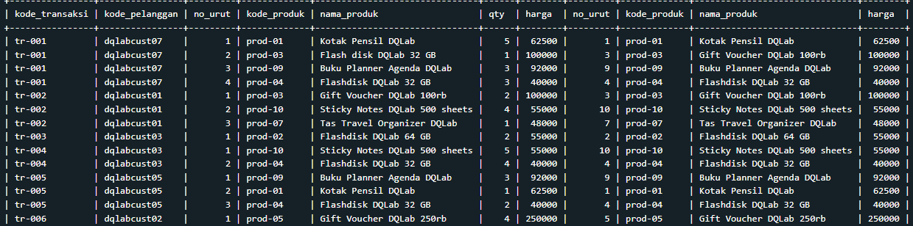
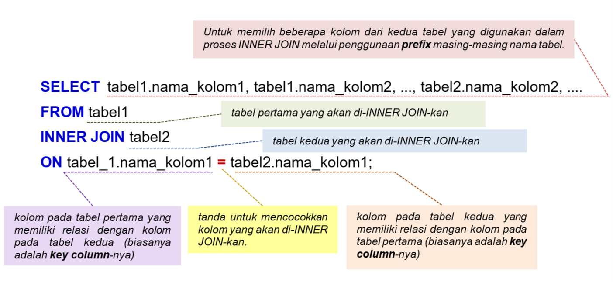
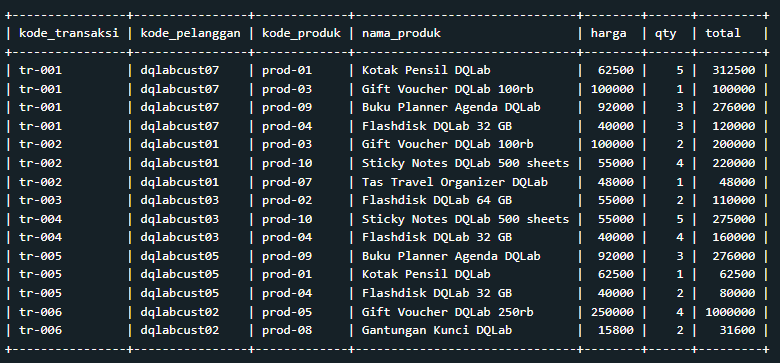

# Syntax INNER JOIN

<br>

Penggunaan prefix pada tabel_1.nama_kolom dan tabel_2.nama_kolom ditujukan agar terdapat kejelasan (clarity) kolom pada tabel mana yang dijadikan acuan dalam proses INNER JOIN. Tentunya, penggunaan prefix ini ini sangat bermanfaat jika ingin menggabungkan beberapa tabel. Untuk penjelasan lebih detail, coba ingat kembali penggunaan prefix dan alias, yang telah dipelajari pada modul "Fundamental SQL with SELECT statement chapter Prefix dan Alias".<br>

Jika masing-masing tabel tersebut dianalogikan sebagai dua himpunan maka proses INNER JOIN ekivalen dengan INTERSECTION (IRISAN) antara dua himpunan.<br>

<br>
Proses INNER JOIN memiliki konsep penggabungan untuk records pada kedua tabel yang bernilai sama.

# Tugas Praktek: Menggunakan INNER JOIN (1/3)

```
SELECT * FROM ms_item_warna
INNER JOIN ms_item_kategori
ON ms_item_warna.nama_barang = ms_item_kategori.nama_item;
```

Output Jawaban<br>
<br>
Hasil yang diperoleh dengan penggunaan **SELECT** … **FROM** … **INNER JOIN** … **ON** …; adalah sama dengan penerapan **SELECT** … **FROM **… **WHERE** …;.

# Quiz 1

#### Mengidentifikasi Key Column tabel tr_penjualan dan ms_produk

“Nah, sebelum kita menggunakan INNER JOIN dalam menggabungkan 2 tabel, seperti yang sudah dijelaskan sebelumnya, kita perlu terlebih dahulu mengetahui kolom mana yang merupakan key kolom yang akan digunakan dalam JOIN. Jadi, manakah yang merupakan key kolom dari kedua tabel **tr_penjualan** dan **ms_produk** tersebut untuk digunakan dalam INNER JOIN?"<br>

#### Solusi Jawaban

- total dari tabel tr_penjualan dengan harga dari tabel ms_produk
- **_Kode_produk dari tabel tr_penjualan dengan kode_produk dari tabel ms_produk_**
- Kode_produk dari tabel tr_penjualan dengan nama_produk dari tabel ms_produk
- No_urut dari tabel tr_penjualan dengan kode_transaksi dari tabel ms_produk

# Tugas Praktek: Menggunakan INNER JOIN (2/3)

“Oke, Aksara. Silakan dipraktikkan pada code editor untuk menggabungkan tabel **tr_penjualan** dan **ms_produk** dan menampilkan seluruh kolom dari kedua tabel.”

```
SELECT * FROM tr_penjualan
INNER JOIN ms_produk
ON tr_penjualan.kode_produk = ms_produk.kode_produk;
```

Output Jawaban<br>
<br>

# Syntax INNER JOIN

### Syntax INNER JOIN – Memilih Beberapa Kolom Untuk Ditampilkan

<br>
Bagian Query <br>

**Catatan:**

"Perlu diperhatikan jika menampilkan kolom dengan nama yang sama di kedua tabel, maka pada bagian Select, tidak bisa hanya mengetikkan nama kolom saja, tetapi juga harus didahului oleh prefix nama tabel dimana kolom itu berasal untuk menghindari error karena ambiguitas,"

# Tugas Praktek: Menggunakan INNER JOIN (3/3)

Menggabungkan tabel **tr_penjualan** dan **ms_produk** dengan kolom yang ditampilkan dari tabel **tr_penjualan** adalah **kode_transaksi**, **kode_pelanggan**, **kode_produk**, **qty**. Untuk tabel **ms_produk** tampilkan kolom **nama_produk** dan **harga**

Kemudian aku membentuk kolom **total** yang merupakan hasil perkalian setiap baris pada kolom **harga** di tabel **ms_produk** dengan kolom **qty** di tabel **tr_penjualan**.

Tabel hasil penggabungan haruslah membentuk kolom-kolom dengan urutannya adalah **kode_transaksi**, **kode_pelanggan**, **kode_produk**, **nama_produk**, **harga**, **qty**, dan **total**

```
SELECT tr_penjualan.kode_transaksi, tr_penjualan.kode_pelanggan, tr_penjualan.kode_produk, ms_produk.nama_produk,ms_produk.harga, tr_penjualan.qty, ms_produk.harga * tr_penjualan.qty AS total
FROM tr_penjualan
INNER JOIN ms_produk
ON tr_penjualan.kode_produk = ms_produk.kode_produk;
```

Output Jawaban<br>
<br>
