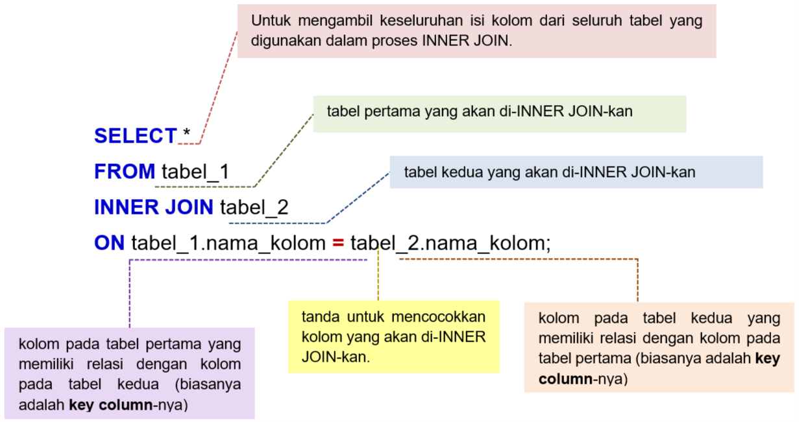
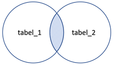

# Syntax INNER JOIN

 

Penggunaan prefix pada tabel_1.nama_kolom dan tabel_2.nama_kolom ditujukan agar terdapat kejelasan (clarity) kolom pada tabel mana yang dijadikan acuan dalam proses INNER JOIN. Tentunya, penggunaan prefix ini ini sangat bermanfaat jika ingin menggabungkan beberapa tabel. Untuk penjelasan lebih detail, coba ingat kembali penggunaan prefix dan alias, yang telah dipelajari pada modul "Fundamental SQL with SELECT statement chapter Prefix dan Alias". 

Jika masing-masing tabel tersebut dianalogikan sebagai dua himpunan maka proses INNER JOIN ekivalen dengan INTERSECTION (IRISAN) antara dua himpunan. 

 
Proses INNER JOIN memiliki konsep penggabungan untuk records pada kedua tabel yang bernilai sama.
