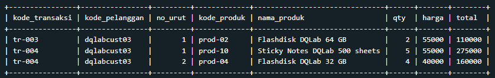
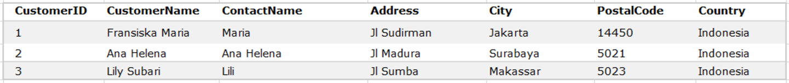
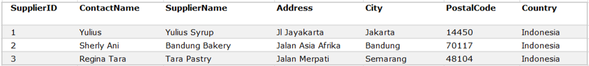
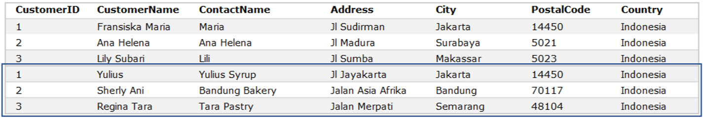

# Penggabungan hasil SELECT secara “Vertikal”

**UNION** adalah operator SQL yang digunakan untuk menggabungkan hasil dari 2 atau lebih **SELECT** - statement secara “Vertikal"

- Setiap hasil dari **SELECT** statement yang akan digabungkan **(UNION)** memiliki jumlah kolom yang sama
- Kolom tersebut juga harus memiliki tipe data yang sama, dan
- Kolom tersebut memiliki urutan posisi yang sama.<br>

Berikut format syntax-nya: <br>
<br>

# Tugas Praktek: Menggunakan UNION

Lakukanlah hal yang sama dengan yang dicontohkan, akan dipilih kode_pelanggan = 'dqlabcust03' sebagai kondisinya.<br>
Jika query-nya diketikkan dengan benar maka tabel penggabungan yang tampil dengan kondisi kode_pelanggan = 'dqlabcust03'

```
SELECT * FROM tabel_A
WHERE kode_pelanggan = 'dqlabcust03'
UNION
SELECT * FROM tabel_B
WHERE kode_pelanggan = 'dqlabcust03';
```

Output Jawaban<br>
<br>

# Menyelaraskan (Conforming) Kolom

“Kebetulan data penjualan ini berada di kedua tabel A & B jumlah kolom dan posisinya sama serta nama kolomnya sama. Bagaimana kalau posisi kolom dari kedua tabelnya tidak sama? Apa tidak bisa di-**UNION**-kan?”

“Tentu saja bisa, kamu bisa menyelaraskan kolom dari kedua tabel di SELECT-statement. Mari kita contohkan dengan data dari tabel berikut ini.”<br>
Tabel **Customers**<br>
<br>
Tabel **Supplier**<br>
<br>

Jumlah kolom dari kedua tabel tersebut sama - sama 7 kolom, tetapi kolom posisi kolom **ContactName** dari kedua tabel tidak sama. Di tabel **Customer**, posisi kolom **ContactName** berada di Kolom ke - 3 sedangkan di tabel supplier berada di kolom ke-2.<br>

Jika langsung menggabungkan keduanya, tanpa menyelaraskan kolom hasilnya akan sebagai berikut:<br>
<br>
Tentunya, ini hasil UNION yang tidak diinginkan, oleh karena itu, urutkan posisi kolom tersebut di SELECT-Statement dan juga pilih kolom yang ingin digabungkan, sehingga tidak perlu semua kolom dari kedua tabel di-UNION-kan, seperti berikut ini :<br>

```
SELECT CustomerName, ContactName, City, PostalCode
FROM Customers
UNION
SELECT SupplierName, ContactName, City, PostalCode
FROM Suppliers;
```

Jika terdapat perbedaan nama kolom antara SELECT-statement pertama dan SELECT-statement kedua, maka secara default akan digunakan nama kolom dari SELECT-statement yang pertama.
