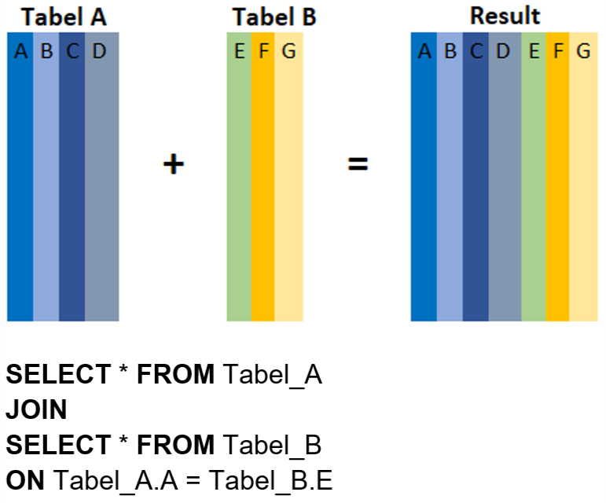
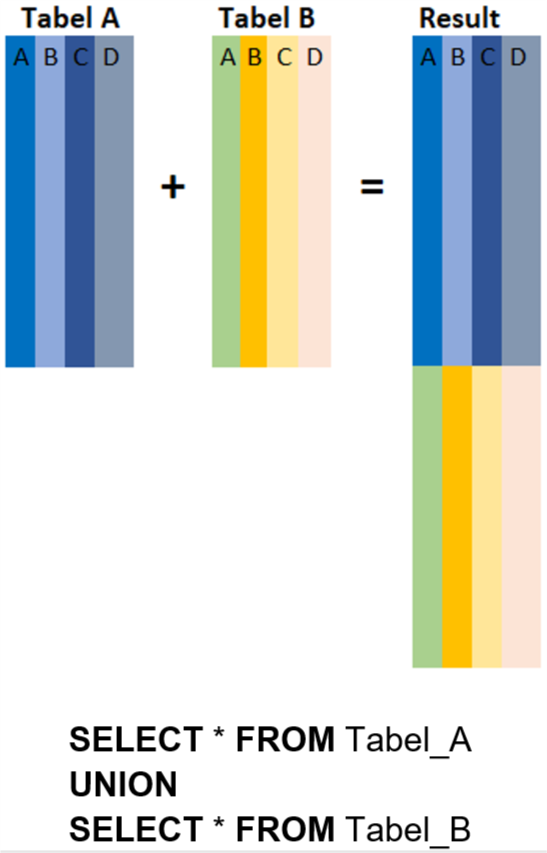

# Penggabungan hasil SELECT secara “Vertikal”

**UNION** adalah operator SQL yang digunakan untuk menggabungkan hasil dari 2 atau lebih **SELECT** - statement secara “Vertikal"

- Setiap hasil dari **SELECT** statement yang akan digabungkan **(UNION)** memiliki jumlah kolom yang sama
- Kolom tersebut juga harus memiliki tipe data yang sama, dan
- Kolom tersebut memiliki urutan posisi yang sama.<br>

Berikut format syntax-nya: <br>
<p align="center">

</p>

# Tugas Praktek: Menggunakan UNION

Lakukanlah hal yang sama dengan yang dicontohkan, akan dipilih kode_pelanggan = 'dqlabcust03' sebagai kondisinya.<br>
Jika query-nya diketikkan dengan benar maka tabel penggabungan yang tampil dengan kondisi kode_pelanggan = 'dqlabcust03'

```
SELECT * FROM tabel_A
WHERE kode_pelanggan = 'dqlabcust03'
UNION
SELECT * FROM tabel_B
WHERE kode_pelanggan = 'dqlabcust03';
```

Output Jawaban<br>
<p align="center">

</p>


# Menyelaraskan (Conforming) Kolom

“Kebetulan data penjualan ini berada di kedua tabel A & B jumlah kolom dan posisinya sama serta nama kolomnya sama. Bagaimana kalau posisi kolom dari kedua tabelnya tidak sama? Apa tidak bisa di-**UNION**-kan?”

“Tentu saja bisa, kamu bisa menyelaraskan kolom dari kedua tabel di SELECT-statement. Mari kita contohkan dengan data dari tabel berikut ini.”<br>
Tabel **Customers**<br>
<p align="center">

</p>
Tabel **Supplier**<br>
<p align="center">

</p>

Jumlah kolom dari kedua tabel tersebut sama - sama 7 kolom, tetapi kolom posisi kolom **ContactName** dari kedua tabel tidak sama. Di tabel **Customer**, posisi kolom **ContactName** berada di Kolom ke - 3 sedangkan di tabel supplier berada di kolom ke-2.<br>

Jika langsung menggabungkan keduanya, tanpa menyelaraskan kolom hasilnya akan sebagai berikut:<br>
<p align="center">

</p>
Tentunya, ini hasil UNION yang tidak diinginkan, oleh karena itu, urutkan posisi kolom tersebut di SELECT-Statement dan juga pilih kolom yang ingin digabungkan, sehingga tidak perlu semua kolom dari kedua tabel di-UNION-kan, seperti berikut ini :<br>

```
SELECT CustomerName, ContactName, City, PostalCode
FROM Customers
UNION
SELECT SupplierName, ContactName, City, PostalCode
FROM Suppliers;
```

Jika terdapat perbedaan nama kolom antara SELECT-statement pertama dan SELECT-statement kedua, maka secara default akan digunakan nama kolom dari SELECT-statement yang pertama.

# Perbedaan antara UNION dan JOIN

Memang benar UNION dan JOIN digunakan untuk menggabungkan data dari dua atau lebih tabel. Tapi yang membedakan adalah bagaimana tabel - tabel itu digabungkan. Kita menggunakan JOIN ketika akan menggabungkan tabel secara horizontal, sehingga hasil join akan memuat kolom - kolom dari kedua atau lebih tabel yang digabungkan. Berikut gambaran penggabungan tabel dengan metode JOIN<br>
<p align="center">

</p>
Pada metode JOIN, penggabungan dilakukan berdasarkan key/kolom tertentu yang terdapat di tabel-tabel yang akan digabungkan dan key/kolom ini memiliki nilai yang saling terkait. Seperti yang terlihat pada gambar, Kolom A dan Kolom E merupakan key/kolom yang saling terkait sehingga kedua tabel dapat digabungkan dengan mencocokan nilai dari kedua kolom ini. Proses JOIN tidak dapat dilakukan jika tidak terdapat key/kolom yang saling terkait di kedua atau lebih tabel yang akan digabungkan.<br>

Untuk UNION seperti yang sudah dijelaskan, digunakan ketika ingin menggabungkan tabel secara secara vertikal yaitu menggabungkan baris/row dari dua atau lebih tabel. Tidak seperti JOIN, untuk penggabungan dengan UNION, tidak diperlukan key/kolom yang saling terkait tetapi UNION mensyaratkan bahwa jumlah kolom dari tabel - tabel yang akan digabungkankan adalah sama dan berada diposisi yang sama pula. Berikut ilustrasi penggabungan dengan UNION:<br>
<p align="center">

</p>
Pada proses penggabungan UNION, tidak terdapat penambahan kolom tetapi jumlah baris/rows yang akan bertambah.

# Quiz

Manakah yang tidak menunjukkan perbedaan antara UNION dan JOIN?<br>
Pilihlah pernyataan yang sesuai berikut ini:<br>

JAWABAN

- JOIN menggabungkan 2 tabel atau lebih berdasarkan baris yang saling berelasi/terkait sedangkan UNION menggabungkan 2 tabel secara vertikal.
- JOIN menggabungkan kolom - kolom dari dua tabel atau lebih menjadi satu tabel sedangkan UNION menggabungkan baris dari dua tabel atau lebih menjadi satu tabel.
- Untuk melakukan JOIN, jumlah kolom dari kedua tabel tidak harus sama tetapi paling tidak satu kolom dari kedua tabel memiliki relation/atribut yang sama; sedangkan untuk melakukan UNION, jumlah, posisi kolom, tipe data dan domain dari kedua tabel harus sama.
- **_JOIN secara horizontal tanpa relasi, dan UNION secara vertikal._**

# Kesimpulan

Pada chapter **UNION** ini telah dipelajari bagaimana menggabungkan dua tabel secara vertikal (bertambah barisnya). Tentunya ada syarat yang harus dipenuhi oleh kedua tabel yang digabungkan dengan UNION, yaitu:<br>

- Setiap hasil dari **SELECT** statement yang akan digabungkan **(UNION)** memiliki jumlah kolom yang sama
- Kolom tersebut juga harus memiliki tipe data yang sama, dan
- Kolom tersebut memiliki urutan posisi yang sama.<br>

Selain itu, mempelajari bagaimana penyelerasan kolom sehingga record/baris yang ditampilkan pada tabel hasil penggabungan memiliki arti.<br>

Perbedaan mendasar dari JOIN dan UNION adalah JOIN menggabungkan 2 tabel atau lebih berdasarkan baris yang saling berelasi/terkait sedangkan UNION menggabungkan 2 tabel secara vertikal.
