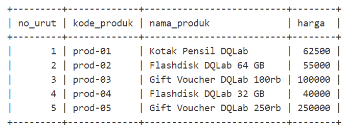
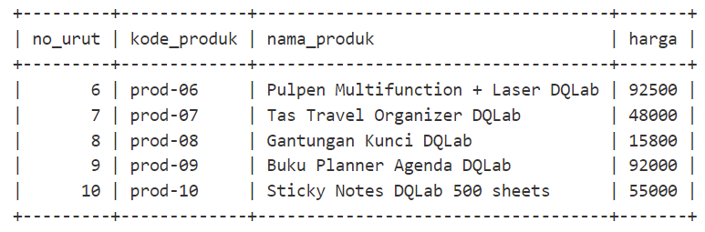
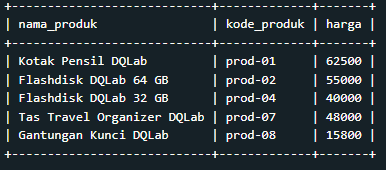

# Project INNER JOIN

Dalam database, terdapat tabel **ms_pelanggan** yang berisi data - data pelanggan yang membeli produk dan tabel **tr_penjualan** yang berisi data transaksi pembelian di suatu store.

Suatu hari, departemen marketing & promotion meminta bantuan untuk meng-query data-data pelanggan yang membeli produk Kotak Pensil DQLab, Flashdisk DQLab 32 GB, dan Sticky Notes DQLab 500 sheets.

Buatlah query menggunakan tabel **ms_pelanggan** dan **tr_penjualan** untuk mendapatkan data - data yang diminta oleh marketing yaitu **kode_pelanggan, nama_customer, alamat.**

**NB:** Gunakan SELECT DISTINCT untuk menghilangkan duplikasi, jika diperlukan.

## Jawaban

```
SELECT DISTINCT ms_pelanggan.kode_pelanggan, ms_pelanggan.nama_customer, ms_pelanggan.alamat FROM ms_pelanggan
INNER JOIN tr_penjualan
ON ms_pelanggan.kode_pelanggan = tr_penjualan.kode_pelanggan
WHERE nama_produk = 'Kotak Pensil DQLab' OR nama_produk = 'Flashdisk DQLab 32 GB' OR nama_produk = 'Sticky Notes DQLab 500 sheets'
```

Output Tabel Jawaban:<br>


# Project UNION

Persiapkanlah data katalog mengenai mengenai nama - nama produk yang akan dijual di suatu store. Data tersebut akan digunakan dalam meeting untuk mereview produk mana saja yang akan dilanjutkan penjualannya dan mana yang tidak akan dilanjutkan.<br>

Siapkan hanya data produk dengan harga di bawah 100K untuk kode produk prod-1 sampai prod-5; dan dibawah 50K untuk kode produk prod-6 sampai prod-10, tanpa mencantumkan kolom no_urut.<br>

Saat mengecek data produk di database, terdapat 2 tabel yang sama - sama berisi data katalog, yaitu:<br>

Tabel **ms_produk_1**<br>
<br>
Tabel **ms_produk_2**<br>
<br>

## Jawaban

```
SELECT nama_produk, kode_produk, harga
FROM ms_produk_1
WHERE harga < 100000
UNION
SELECT nama_produk, kode_produk, harga
FROM ms_produk_2
WHERE harga < 50000;
```

Output Tabel Jawaban:<br>

