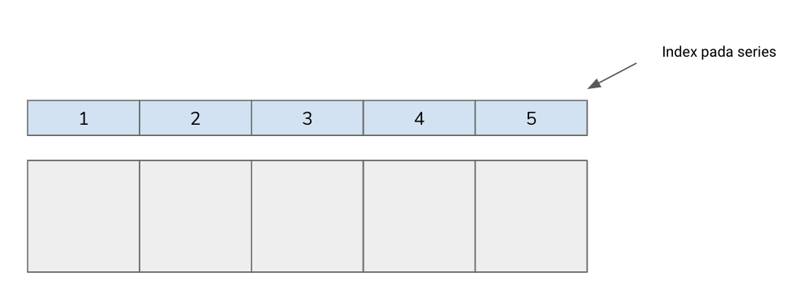
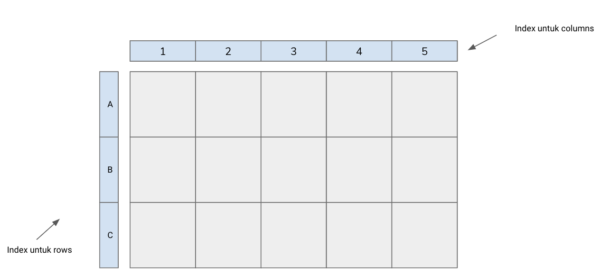

# Library NumPy

Numpy berasal dari kata ‘**_Numerical Python_**’, sesuai namanya NumPy berfungsi sebagai library untuk melakukan proses komputasi numerik terutama dalam bentuk array multidimensional (1-Dimensi ataupun 2-Dimensi). Array merupakan kumpulan dari variabel yang memiliki tipe data yang sama. NumPy menyimpan data dalam bentuk arrays. 

Bentuk 1D NumPy **_array_** dapat diilustrasikan sebagai berikut: 
 
Bentuk 2D NumPy **_array_** dapat diilustrasikan sebagai berikut: 
 

# Library Pandas

Pandas merupakan library yang memudahkan dalam melakukan manipulasi, **_cleansing_** maupun analisis struktur data. Dengan menggunakan Pandas, dapat memanfaatkan lima fitur utama dalam pemrosesan dan analisis data, yaitu **_load, prepare, manipulate, modelling,_** dan **_analysis data._**

Pandas menggunakan konsep array dari NumPy namun memberikan index kepada array tersebut, sehingga disebut **_series_** ataupun **_data frame_**. Sehingga bisa dikatakan Pandas menyimpan data dalam **_dictionary-based_** NumPy arrays. 1-Dimensi labelled array dinamakan sebagai Series. Sedangkan 2-Dimensi dinamakan sebagai **_Data Frame_**. 

Bentuk dari **_series_** diilustrasikan sebagai berikut: 
 
Bentuk dari **_data frame_** diilustrasikan sebagai berikut: 
 
