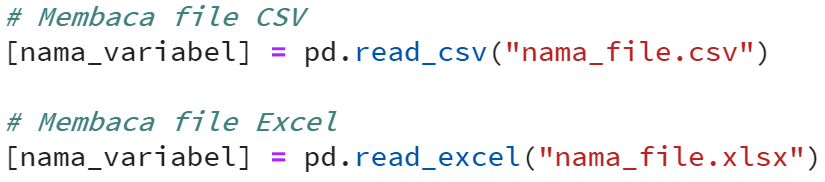

# Membaca file dari Excel atau CSV sebagai data frame

Salah satu fungsi Pandas yaitu melakukan load data dari CSV atau Excel file. Syntax yang digunakan untuk melakukan operasi tersebut, yaitu: 

# Inspeksi struktur data frame

Setelah melakukan proses loading dataframe ke dalam Python. Hal selanjutnya sebelum memulai analisis tentunya mengerti struktur dataset tersebut. Sehingga langkah selanjutnya dari pre - analisis biasanya dilakukan untuk: 

1. melihat struktur data frame,
2. melihat preview data dari dataframe tersebut, dan
3. membuat summary data sederhana dari dataset.
