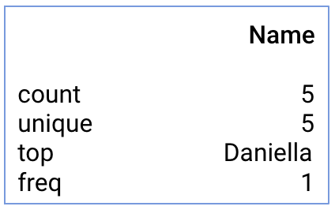

# Membaca file dari Excel atau CSV sebagai data frame

Salah satu fungsi Pandas yaitu melakukan load data dari CSV atau Excel file. Syntax yang digunakan untuk melakukan operasi tersebut, yaitu:<br>


# Inspeksi struktur data frame

Setelah melakukan proses loading dataframe ke dalam Python. Hal selanjutnya sebelum memulai analisis tentunya mengerti struktur dataset tersebut. Sehingga langkah selanjutnya dari pre - analisis biasanya dilakukan untuk:<br>

1. melihat struktur data frame,
2. melihat preview data dari dataframe tersebut, dan
3. membuat summary data sederhana dari dataset.

# Melihat struktur kolom dan baris dari data frame

Hal pertama dalam mengerti struktur dari dataframe adalah informasi mengenai berapa size dari dataframe yang akan digunakan termasuk berapa jumlah kolom dan jumlah baris data frame tersebut. <br>

Dalam kasus ini, aku dapat menggunakan **_attribute_** <code>.shape</code> pada suatu dataframe. Syntaxnya dinyatakan dengan:<br>


# Melihat preview data dari data frame

Selanjutnya, untuk mendapatkan gambaran dari konten dataframe tersebut. Kita dapat menggunakan **_function_** **head** dan **tail**, dengan syntax:<br>
<br>
Jika [jumlah_data] pada function **head** dan **tail** dikosongkan maka secara default akan ditampilkan sebanyak 5 (lima) baris saja. Sehingga bisa ditulis sebagai berikut:<br>
<br>

# Statistik Deskriptif dari Data Frame - Part 1

Statistik deskriptif atau summary dalam Python - Pandas, dapat diperoleh dengan menggunakan fungsi **describe()**, yaitu:<br>
<br>

**_Function describe_** dapat memberikan informasi mengenai nilai rataan, standar deviasi dan IQR (**_interquartile range_**).<br>

Ketentuan umum:<br>

- Secara umum function **describe()** akan secara otomatis mengabaikan kolom **_category_** dan hanya memberikan **_summary_** statistik untuk kolom berjenis numerik.
- Kita perlu menambahkan **_argument_** bernama **include = "all"** untuk mendapatkan summary statistik atau statistik deskriptif dari kolom numerik dan karakter.<br>
  yaitu
  <br>

**Contoh penggunaan describe() di Pandas!**

Terdapat dataframe Pandas dengan nama **nilai_skor_df** dengan informasi seperti gambar dibawah:<br>
<br>
dengan menggunakan fungsi describe pada **_nilai_skor_df_**
<code>print(nilai_skor_df.describe())</code> <br>
menghasilkan<br>

<br>

# Statistik Deskriptif dari Data Frame - Part 2

Jika ingin mendapatkan summary statistik dari kolom yang tidak bernilai angka, maka aku dapat menambahkan command **include=["object"]** pada syntax **describe()**. <br>
<code>print(nilai_skor_df.describe(include=["object"]))</code> <br>
hasil<br>

<br><br>

Function **describe()** dengan **include="all"** akan memberikan **_summary_** statistik dari semua kolom. Contoh penggunaannya:<br>
<code>print(nilai_skor_df.describe(include=["all"]))</code> <br>
hasil<br>

<br>

# Statistik Deskriptif dari Data Frame - Part 3

Selanjutnya, untuk mencari rataan dari suatu data dari dataframe. Aku dapat menggunakan syntax **mean, median,** dan **mode** dari Pandas.
<code>print([nama_dataframe].loc[;, "nama_kolom"].mean())</code><br>
<code>print([nama_dataframe].loc[;, "nama_kolom"].median())</code><br>
<code>print([nama_dataframe].loc[;, "nama_kolom"].mode())</code><br>

**Contoh Penggunaan:**

```
print(nilai_skor_df).loc[;, "Age"].mean())
print(nilai_skor_df).loc[;, "Score"].median())
```

Memberikan hasil:<br>

```
21.4 # Mean
78   # Median
```
