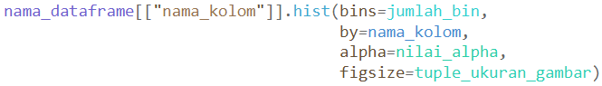
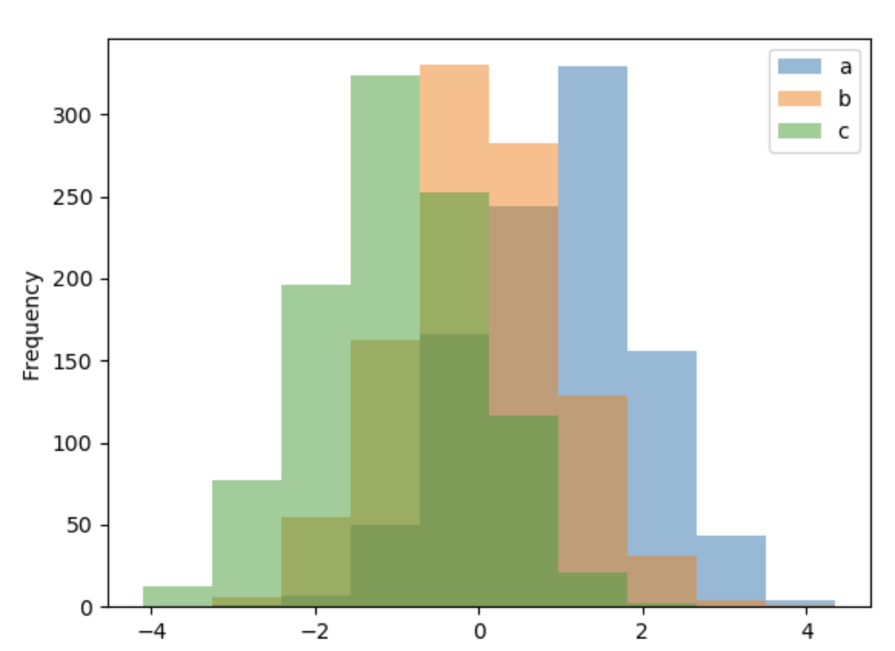
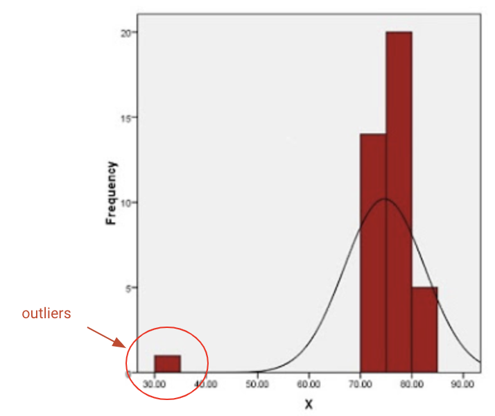

# Mengenal dan Membuat Distribusi Data dengan Histogram

Histogram merupakan salah satu cara untuk mengidentifikasi sebaran distribusi dari data. Histogram adalah grafik yang berisi ringkasan dari sebaran (dispersi atau variasi) suatu data. Pada histogram, tidak ada jarak antar batang/bar dari grafik. Hal ini dikarenakan bahwa titik data kelas bisa muncul dimana saja di daerah cakupan grafik. Sedangkan ketinggian bar sesuai dengan frekuensi atau frekuensi relatif jumlah data di kelas. Semakin tinggi bar, semakin tinggi frekuensi data. Semakin rendah bar, semakin rendah frekuensi data.

Syntax Umum: <br>


Beberapa atribut penting dalam histogram pandas:

- **_bins_** = jumlah_bins dalam histogram yang akan digunakan. Jika tidak didefinisikan jumlah_bins, maka function akan secara default menentukan jumlah_bins sebanyak 10.
- **_by_** = nama kolom di DataFrame untuk di group by. (valuenya berupa nama column di dataframe tersebut).
- **_alpha_** = nilai_alpha untuk menentukan opacity dari plot di histogram. (value berupa range 0.0 - 1.0, dimana semakin kecil akan semakin kecil opacity nya)
- **_figsize_** = tuple_ukuran_gambar yang digunakan untuk menentukan ukuran dari plot histogram. Contoh: figsize=(10,12)



# Standar Deviasi dan Varians pada Pandas

Varians dan standar deviasi juga merupakan suatu ukuran dispersi atau variasi. Standar deviasi merupakan ukuran dispersi yang paling banyak dipakai. Hal ini mungkin karena standar deviasi mempunyai satuan ukuran yang sama dengan satuan ukuran data asalnya. Sedangkan varians memiliki satuan kuadrat dari data asalnya (misalnya cm^2).<br>

Syntax dari standar deviasi dan varians pada Pandas:<br>

```
print([namadataframe].loc[:, "nama_kolom"].std())
print([namadataframe].loc[:, "nama_kolom"].var())
```

Contoh penggunaan pada dataframe **nilai_skor_df**:

```
print(nilai_skor_df.loc[:, "Age"].std())
print(nilai_skor_df.loc[:, "Score"].var())
```

Hasil: <br>

> 2.701851217 <br>
> 152.8

# Menemukan Outliers Menggunakan Pandas

**Outliers** merupakan data observasi yang muncul dengan nilai-nilai ekstrim. Yang dimaksud dengan nilai-nilai ekstrim dalam observasi adalah nilai yang jauh atau beda sama sekali dengan sebagian besar nilai lain dalam kelompoknya.<br>
<br>

Pada umumnya, outliers dapat ditentukan dengan metric IQR (interquartile range).<br>

Rumus dasar dari IQR: Q3 - Q1. Dan data suatu observasi dapat dikatakan outliers jika memenuhi kedua syarat dibawah ini:<br>

- data < Q1 - 1.5 \* IQR
- data > Q3 + 1.5 \* IQR
