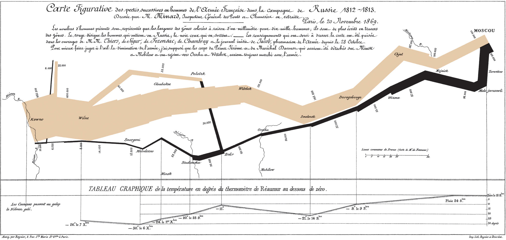
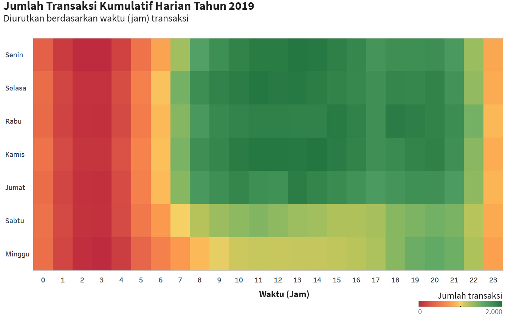
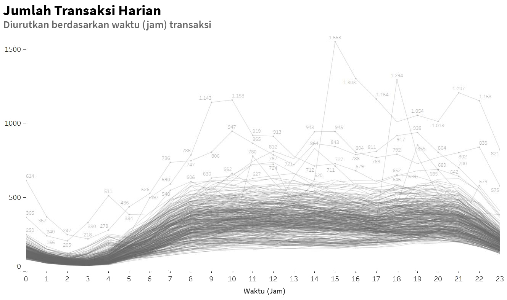

# Mengenal visualisasi data

Visualisasi data dapat didefinisikan sebagai cara merepresentasikan data melalui **komponen visual, seperti posisi, komposisi, panjang, luas, dan warna**. Visualisasi data juga mencakup cara berkomunikasi secara efektif kepada audiens melalui bahasa gambar. 

**Coba perhatikan Gambar 1**. Gambar tersebut dibuat oleh engineer asal Prancis, Charles Joseph Minard, yang terlibat dalam invasi militer Napoleon ke Rusia pada 1812-1813. 

    

 

    <b>Gambar 1</b>: Grafik kekuatan pasukan Napoleon dalam invasi ke Rusia pada 1812-1813.

Garis coklat dan hitam memperlihatkan kekuatan pasukan dari Prancis menuju dan kembali dari Moskow. Lebar garis menggambarkan banyaknya serdadu. Lebarnya mengecil karena jumlahnya terus menyusut. 

Gambar yang dibuat tahun 1869 tersebut juga memperlihatkan peta, rute dan arah perjalanan, jarak tempuh, hingga grafik temperatur pada medan yang dilalui. 

Siapapun yang melihatnya, dan paham bahasanya, akan dengan mudah mengetahui data dan cerita yang disampaikan dalam gambar tersebut. Invasi itu berakhir dengan hilangnya sebagian besar kekuatan Napoleon. Awalnya lebih dari 400.000-an prajurit, yang kembali hanya 10.000-an. Sisanya menjadi korban akibat penyakit, suhu dingin, kelaparan, atau serangan lawan. Tragis!

# Urgensi Visualisasi Data

Dari contoh sebelumnya, jelaslah bahwa penyajian data dengan visualisasi yang tepat bisa dengan cepat mendapat perhatian audiens dan membuatnya paham tentang apa yang disampaikan.

Itulah tujuan utama visualisasi data. Bukan sekadar membuat tampilan data yang enak dilihat, tetapi juga harus bisa membuat data lebih mudah dipahami, jelas, dan menarik. Yang tidak kalah penting, harus dapat meyakinkan audiens sesuai kesimpulan dan narasi yang dibangun analis.

Pembahasan tentang visualisasi data ini dimaksudkan dengan tujuan sebagai berikut:

1. **Memecahkan masalah, bukan sekadar tampil cantik**. Ingatlah bahwa informasi visual lebih bukan mengutamakan hasil akhir berupa infografik atau presentasi serba indah. Sasarannya adalah memproses dan mengorganisasi fakta dan data, menemukan pola, hingga menghasilkan solusi. Desain visual membantu mengomunikasikan penyelesaian masalah itu agar mudah dipahami. 
2. **Fokus pada target dan audiens, bukan tools ataupun tekniknya**. Modul ini tidak mewajibkan penggunaan aplikasi tertentu ataupun teknik khusus untuk memvisualkan data. Maka itu diperbolehkan menggunakan cara dan tools apa pun untuk itu. Yang diutamakan adalah apa tujuan menampilkan data tersebut dan siapakah audiensnya. 
3. **Panduan dan alur, bukan asal menata gambar**. Urutan dan penempatan elemen visual harus dapat memandu audiens untuk memahami masalah hingga menuju jalan keluarnya. Memilih jenis dan ukuran huruf, warna yang tepat, mengatur tata letak visualnya, serta mengatur pola elemen visual menjadi penting agar audiens memahami maksud dan pesan yang dimunculkan dari data. 
4. **Konsep dan kerangka berpikir, bukan cuma kreativitas visual**. Visualisasi data adalah mentransfer konsep dan cara berpikir atas data dan proses analisisnya dengan cara yang mudah dipahami oleh oleh manusia. Tujuannya adalah meyakinkan audiens dengan konsep dan kerangka pikir yang dibangun. Data dan analisisnya menjadi bukti penguat dan tak terbantahkan atas konsep tersebut. 
5. **Kontekstual**. Data yang disajikan harus saling mendukung satu sama lain. Rangkaian visual yang dibuat harus memiliki konteks yang sama dan terorganisasi dengan baik sehingga menambah kejelasan makna dari pesan yang ingin disampaikan. 

# Eksploratif versus naratif

Sebelum menentukan visual yang cocok atas suatu data, seorang analis data harus memahami siapa atau audiens yang akan membaca data tersebut. Dengan mengetahui karakter audiens, seorang data analis akan bisa memperkirakan kepadatan data dan informasi yang akan disajikan. 

Hal itu akan mempengaruhi pilihan visualisasi data, yakni visual yang mengeksplorasi data sedetail mungkin atau grafis yang menarasikan informasi dengan ringkas dan jelas. Apa bedanya? 

**Visual naratif** seringkali digunakan untuk presentasi, biasanya statis, dan berisi ringkasan informasi. Tujuan utamanya adalah menjelaskan hasil akhir atau kesimpulan dari analis.

Hasil tersebut bisa jadi disebarluaskan untuk banyak orang dengan berbagai tingkat pemahaman terhadap data. Audiens tidak perlu lama-lama membacanya dan semestinya bisa segera memahaminya. Oleh karena itu, penyajiannya cenderung menonjolkan keindahan visual. Maka tidak heran bila informasi tidak disampaikan secara detail, misalnya grafik tanpa legenda, label data, ataupun detail lain.

Contoh visual naratif dapat dilihat **pada Gambar 1**.

     
    <b>Gambar 1</b>: Heatmap menggambarkan transaksi kumulatif harian selama satu tahun. Grafik ini tidak menampilkan data secara detail karena tujuan utamanya adalah memperlihatkan pada jam berapa transaksi tertinggi dan terendah terjadi.

Sebaliknya, visual eksploratif bertujuan memaparkan proses yang dilakukan untuk mendapatkan hasil akhir yang tepat. Penyajiannya dibuat serinci dan seakurat mungkin untuk meyakinkan bahwa prosesnya benar.  

**Visual eksploratif** cenderung menampilkan banyak data. Audiensnya pun tidak sembarang orang karena butuh waktu lebih lama untuk mencerna kompleksitas data tersebut. Visual ini lebih ditujukan untuk orang-orang yang memang memahami data atau bisa menginvestigasi data tersebut. Contoh visual eksploratif dapat dilihat pada **Gambar 2**. 

     
    <b>Gambar 2</b>:  Grafik transaksi harian selama satu tahun. Grafik menggunakan elemen secara detail untuk memperlihatkan performa per jam setiap hari.

Baik visual naratif maupun eksploratif ini memiliki tantangan tersendiri dalam pengerjaannya. Untuk grafis naratif, sudah jelas bahwa kekuatan penyajiannya terletak pada cerita dan pesan dari narasi yang disampaikan. **Cerita dan pesan** itu akan mudah dipahami apabila didukung dengan paparan yang tidak bertele-tele dan kemasan visual "menuntun" audiens pada tujuan yang sama. Wujudnya bisa berupa infografik, **_annual report_**, materi promosi, hingga **_company profile_**.

Adapun visual eksploratif haruslah menonjolkan kekuatan analisis, hubungan sebab-akibat perubahan data, dan proses lain. Detail data ditampilkan untuk mendukung kesahihan analisis.
