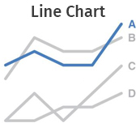
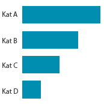

# Proses visualisasi data

“Sebelum menarasikan data, sebenarnya apa yang harus kita perhatikan ya?”

“Pertama, **apa**. Tanyakan pada dirimu, pesan/hal apa yang paling ingin kamu sampaikan kepada audiens. Misalnya, kamu ingin audiens tahu bahwa performa perusahaan terus menurun. Atau, kinerja perusahaan sedang bagus, tetapi sebetulnya masih perlu ada perbaikan di beberapa sektor. Jika pesan utama sudah diketahui, periksalah apakah data dan grafik yang kamu miliki sudah menunjukkan dengan jelas pesan tersebut,” jelas Senja.

“Kedua, **untuk apa** orang lain perlu mengetahui hal yang kamu sampaikan tadi. Di sinilah kamu tunjukkan hasil analisismu terhadap data yang kamu miliki. Hasil analisismu harus bisa membuktikan bahwa pesan yang kamu sampaikan tadi penting karena ada efek lanjutan yang tak kalah penting dari pesan tersebut. Dari contoh tadi, misalnya, kamu ingin audiens tahu bahwa performa perusahaan akan semakin anjlok jika tidak segera mengambil tindakan tepat. Atau, untuk contoh kedua, perusahaan sebetulnya bisa mendapatkan hasil lebih maksimal jika sektor-sektor tertentu segera mengevaluasi kinerjanya yang merosot,” tambah Senja.

Tak kusangka cukup banyak juga hal yang tak boleh kulewatkan saat mengolah dan menarasikan data.

“Terakhir, **bagaimana** caranya agar masalah yang kamu sampaikan tadi bisa teratasi. Di sini kamu bisa menyampaikan sejumlah alternatif solusi atau action plan yang diperlukan, tentunya berdasarkan analisis data yang menunjukkan bahwa rencana itulah yang paling baik untuk ditindaklanjuti. Jadi, sudah cukup jelas ya, Aksara?”

“Satu lagi, Aksara. Itu baru langkah awal. Dengan cara itu, setidaknya kamu bisa lebih fokus pada pesan yang ingin kamu sampaikan kepada audiens. Kamu juga bisa lebih fokus menentukan data apa saja yang perlu disajikan. Ini penting karena pada langkah berikutnya, kamu bisa melanjutkan analisis data dan menyampaikan kesimpulan yang benar-benar berkaitan dengan masalah yang kamu paparkan.”

“Kelihatannya sih mudah, tapi sebenarnya penuh tantangan yah, Nja?”

“Begini saja. Kalau kamu kesulitan melakukannya, buatlah sketsa atau coretan-coretan seperlunya tentang tiga hal tadi. Saya bisa berikan contohnya **(lihat Gambar 1)**.”

Aku pun mempelajari gambar yang dibagikan Senja. 

     
    <b>Gambar 1</b>

# Pilah-pilih grafik

Penting sekali memperkenalkan visualisasi data dengan sesederhana mungkin agar alur membaca dan mengambil kesimpulan atas elemen visual yang ditampilkan dengan lebih mudah.

Ada berbagai macam cara menampilkan data, entah dalam bentuk grafik, angka, atau teks. Cara menampilkannya tergantung pada pesan yang ingin disampaikan kepada audiens. Berikut penjelasan singkat tentang sejumlah pilihan visualisasi data. 

| 
Jenis Grafik
 | 
Bentuk
                            | 
Keterangan
                                                                                                                                                                                                                                                                                                                                                                                                                                                                                                                                                                                       |
| ---------------------------------- | ------------------------------------------------------- | ---------------------------------------------------------------------------------------------------------------------------------------------------------------------------------------------------------------------------------------------------------------------------------------------------------------------------------------------------------------------------------------------------------------------------------------------------------------------------------------------------------------------------------------------------------------------------------------------------------------------- |
| **Teks dan Angka**                 | 
 
   | Data tidak harus ditampilkan dalam bentuk grafik. Dapat menggunakan teks dan angka saja, dengan catatan hanya 1-2 data yang ingin ditampilkan.   Beri penebalan atau warna berbeda pada angka atau teks yang ingin ditonjolkan agar perhatian pembaca terarah pada bagian tersebut.                                                                                                                                                                                                                                                                                                                              |
| **Diagram Garis**                  | 
 
   | Line chart paling tepat digunakan untuk menunjukkan tren dari waktu ke waktu. Sumbu X biasanya mewakili periode waktu, sumbu Y menggambarkan nilai/kuantitas. Contohnya jumlah penjualan dari pekan ke pekan selama satu tahun.   Grafik ini dapat memuat banyak titik data yang dapat diatur saling berdekatan sesuai kerapatan periode waktu. Karena visualnya yang simpel, bisa menggunakan banyak garis sekaligus dalam satu tampilan. Ini memudahkan penggambaran data tren dari beragam kategori.                                                                                                          |
| **Diagram Area**                   | 
 
   | Diagram ini merupakan pengembangan dari diagram garis. Diagram area kerap digunakan untuk menggambarkan nilai total dalam angka maupun persentase dari waktu ke waktu.   Pemilihan warna dan volume area menjadi penting untuk menitikberatkan bagian mana yang ingin ditonjolkan. Yang perlu diperhatikan saat menggunakan diagram ini adalah, jangan sampai ada area yang menutupi area lain.                                                                                                                                                                                                                  |
| **Diagram Batang**                 | 
 
 | Disebut juga dengan **_bar chart_**, paling cocok untuk komparasi data dengan banyak kategori atau rangkaian data (**_data series_**). Keterangan panjang pada kategori sangat dimungkinkan dan diletakkan pada sumbu Y.   Lebar batang dalam **_horizontal bar_** ditentukan dari nilai data pada sumbu X. Tinggi batang sekitar dua kali celah antarbatang.  Untuk jenis data kategori, jarak antarbatang tidak boleh terlalu rapat karena setiap batang merupakan kategori yang berdiri sendiri, bukan suatu rangkaian data yang saling terkait. Contohnya grafik penjualan berdasarkan produk.   |

Disebut juga dengan bar chart, paling cocok untuk komparasi data dengan banyak kategori atau rangkaian data (data series). Keterangan panjang pada kategori sangat dimungkinkan dan diletakkan pada sumbu Y.

Lebar batang dalam horizontal bar ditentukan dari nilai data pada sumbu X. Tinggi batang sekitar dua kali celah antarbatang.

Untuk jenis data kategori, jarak antarbatang tidak boleh terlalu rapat karena setiap batang merupakan kategori yang berdiri sendiri, bukan suatu rangkaian data yang saling terkait. Contohnya grafik penjualan berdasarkan produk.

Untuk kemudahan membaca data, dapat mengurutkan kategori berdasarkan besar nilainya, misal dari nilai tertinggi hingga terendah.
Lain halnya dengan **_data series_**, di mana data didistribusikan berdasarkan kategori berjenjang, misalnya populasi penduduk berdasarkan rentang usia atau tingkat pendidikan.  Urutan kategori tidak boleh diubah, harus sesuai dengan jenjangnya. Celah antarbatang dapat dipersempit hingga hampir menempel. Grafik untuk **_data series_** seperti ini sering disebut dengan histogram. |
