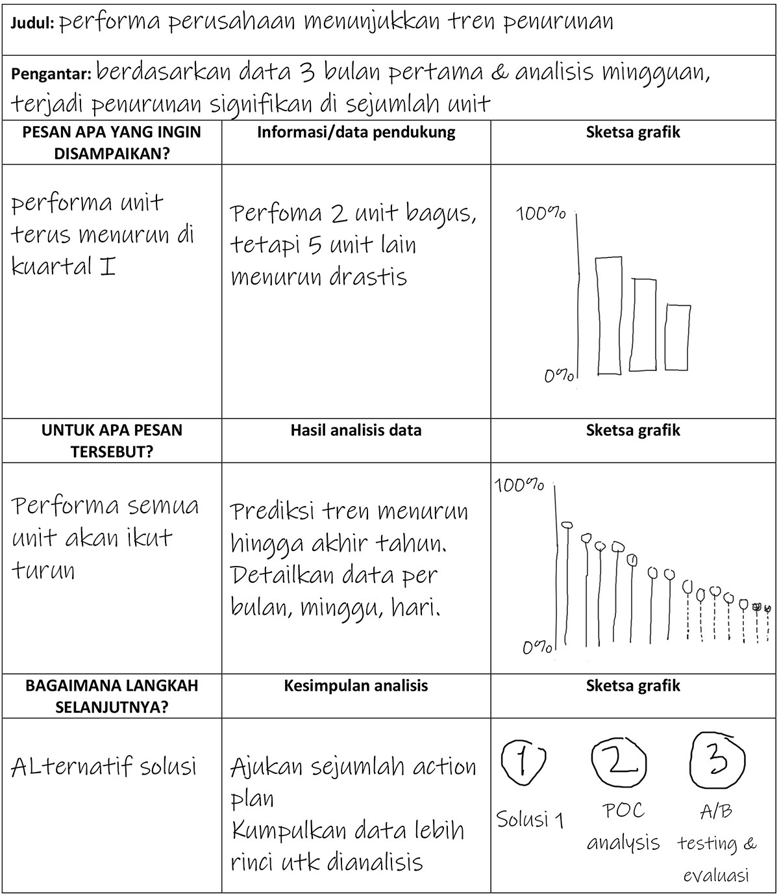

# Proses visualisasi data

“Sebelum menarasikan data, sebenarnya apa yang harus kita perhatikan ya?”

“Pertama, **apa**. Tanyakan pada dirimu, pesan/hal apa yang paling ingin kamu sampaikan kepada audiens. Misalnya, kamu ingin audiens tahu bahwa performa perusahaan terus menurun. Atau, kinerja perusahaan sedang bagus, tetapi sebetulnya masih perlu ada perbaikan di beberapa sektor. Jika pesan utama sudah diketahui, periksalah apakah data dan grafik yang kamu miliki sudah menunjukkan dengan jelas pesan tersebut,” jelas Senja.

“Kedua, **untuk apa** orang lain perlu mengetahui hal yang kamu sampaikan tadi. Di sinilah kamu tunjukkan hasil analisismu terhadap data yang kamu miliki. Hasil analisismu harus bisa membuktikan bahwa pesan yang kamu sampaikan tadi penting karena ada efek lanjutan yang tak kalah penting dari pesan tersebut. Dari contoh tadi, misalnya, kamu ingin audiens tahu bahwa performa perusahaan akan semakin anjlok jika tidak segera mengambil tindakan tepat. Atau, untuk contoh kedua, perusahaan sebetulnya bisa mendapatkan hasil lebih maksimal jika sektor-sektor tertentu segera mengevaluasi kinerjanya yang merosot,” tambah Senja.

Tak kusangka cukup banyak juga hal yang tak boleh kulewatkan saat mengolah dan menarasikan data.

“Terakhir, **bagaimana** caranya agar masalah yang kamu sampaikan tadi bisa teratasi. Di sini kamu bisa menyampaikan sejumlah alternatif solusi atau action plan yang diperlukan, tentunya berdasarkan analisis data yang menunjukkan bahwa rencana itulah yang paling baik untuk ditindaklanjuti. Jadi, sudah cukup jelas ya, Aksara?”

“Satu lagi, Aksara. Itu baru langkah awal. Dengan cara itu, setidaknya kamu bisa lebih fokus pada pesan yang ingin kamu sampaikan kepada audiens. Kamu juga bisa lebih fokus menentukan data apa saja yang perlu disajikan. Ini penting karena pada langkah berikutnya, kamu bisa melanjutkan analisis data dan menyampaikan kesimpulan yang benar-benar berkaitan dengan masalah yang kamu paparkan.”

“Kelihatannya sih mudah, tapi sebenarnya penuh tantangan yah, Nja?”

“Begini saja. Kalau kamu kesulitan melakukannya, buatlah sketsa atau coretan-coretan seperlunya tentang tiga hal tadi. Saya bisa berikan contohnya **(lihat Gambar 1)**.”

Aku pun mempelajari gambar yang dibagikan Senja. 

     
    <b>Gambar 1</b>

# Pilah-pilih grafik

Penting sekali memperkenalkan visualisasi data dengan sesederhana mungkin agar alur membaca dan mengambil kesimpulan atas elemen visual yang ditampilkan dengan lebih mudah.

Ada berbagai macam cara menampilkan data, entah dalam bentuk grafik, angka, atau teks. Cara menampilkannya tergantung pada pesan yang ingin disampaikan kepada audiens. Berikut penjelasan singkat tentang sejumlah pilihan visualisasi data. 

| 
Jenis Grafik
 | 
Bentuk
                               | 
Keterangan
                                                                                                                                                                                                                                                                                                                                                                                                                                                                                                                                                                                                                                                                                                                                                                                                                                                                                                                                                                                                                                                                                                                                                                                                                                                                                                                                                                                                                                                                                                                                                                                                                                                                                                                                   |
| ---------------------------------- | ---------------------------------------------------------- | ------------------------------------------------------------------------------------------------------------------------------------------------------------------------------------------------------------------------------------------------------------------------------------------------------------------------------------------------------------------------------------------------------------------------------------------------------------------------------------------------------------------------------------------------------------------------------------------------------------------------------------------------------------------------------------------------------------------------------------------------------------------------------------------------------------------------------------------------------------------------------------------------------------------------------------------------------------------------------------------------------------------------------------------------------------------------------------------------------------------------------------------------------------------------------------------------------------------------------------------------------------------------------------------------------------------------------------------------------------------------------------------------------------------------------------------------------------------------------------------------------------------------------------------------------------------------------------------------------------------------------------------------------------------------------------------------------------------------------------------------------------------ |
| **Teks dan Angka**                 | 
 
      | Data tidak harus ditampilkan dalam bentuk grafik. Dapat menggunakan teks dan angka saja, dengan catatan hanya 1-2 data yang ingin ditampilkan.   Beri penebalan atau warna berbeda pada angka atau teks yang ingin ditonjolkan agar perhatian pembaca terarah pada bagian tersebut.                                                                                                                                                                                                                                                                                                                                                                                                                                                                                                                                                                                                                                                                                                                                                                                                                                                                                                                                                                                                                                                                                                                                                                                                                                                                                                                                                                                                                                                                          |
| **Diagram Garis**                  | 
 
      | Line chart paling tepat digunakan untuk menunjukkan tren dari waktu ke waktu. Sumbu X biasanya mewakili periode waktu, sumbu Y menggambarkan nilai/kuantitas. Contohnya jumlah penjualan dari pekan ke pekan selama satu tahun.   Grafik ini dapat memuat banyak titik data yang dapat diatur saling berdekatan sesuai kerapatan periode waktu. Karena visualnya yang simpel, bisa menggunakan banyak garis sekaligus dalam satu tampilan. Ini memudahkan penggambaran data tren dari beragam kategori.                                                                                                                                                                                                                                                                                                                                                                                                                                                                                                                                                                                                                                                                                                                                                                                                                                                                                                                                                                                                                                                                                                                                                                                                                                                      |
| **Diagram Area**                   | 
 
      | Diagram ini merupakan pengembangan dari diagram garis. Diagram area kerap digunakan untuk menggambarkan nilai total dalam angka maupun persentase dari waktu ke waktu.   Pemilihan warna dan volume area menjadi penting untuk menitikberatkan bagian mana yang ingin ditonjolkan. Yang perlu diperhatikan saat menggunakan diagram ini adalah, jangan sampai ada area yang menutupi area lain.                                                                                                                                                                                                                                                                                                                                                                                                                                                                                                                                                                                                                                                                                                                                                                                                                                                                                                                                                                                                                                                                                                                                                                                                                                                                                                                                                              |
| **Diagram Batang**                 | 
 
    | Disebut juga dengan **_bar chart_**, paling cocok untuk komparasi data dengan banyak kategori atau rangkaian data (**_data series_**). Keterangan panjang pada kategori sangat dimungkinkan dan diletakkan pada sumbu Y.   Lebar batang dalam **_horizontal bar_** ditentukan dari nilai data pada sumbu X. Tinggi batang sekitar dua kali celah antarbatang.  Untuk jenis data kategori, jarak antarbatang tidak boleh terlalu rapat karena setiap batang merupakan kategori yang berdiri sendiri, bukan suatu rangkaian data yang saling terkait. Contohnya grafik penjualan berdasarkan produk.  Disebut juga dengan bar chart, paling cocok untuk komparasi data dengan banyak kategori atau rangkaian data (data series). Keterangan panjang pada kategori sangat dimungkinkan dan diletakkan pada sumbu Y.  Lebar batang dalam horizontal bar ditentukan dari nilai data pada sumbu X. Tinggi batang sekitar dua kali celah antarbatang.  Untuk jenis data kategori, jarak antarbatang tidak boleh terlalu rapat karena setiap batang merupakan kategori yang berdiri sendiri, bukan suatu rangkaian data yang saling terkait. Contohnya grafik penjualan berdasarkan produk  Untuk kemudahan membaca data, dapat mengurutkan kategori berdasarkan besar nilainya, misal dari nilai tertinggi hingga terendah  Lain halnya dengan **_data series_**, di mana data didistribusikan berdasarkan kategori berjenjang, misalnya populasi penduduk berdasarkan rentang usia atau tingkat pendidikan.  Urutan kategori tidak boleh diubah, harus sesuai dengan jenjangnya. Celah antarbatang dapat dipersempit hingga hampir menempel. Grafik untuk **_data series_** seperti ini sering disebut dengan histogram. |
| **Grafik Kolom**                   | 
 
    | Column chart atau vertical chart bisa digunakan untuk melihat perbandingan sejumlah kategori dan atau perubahannya dalam periode waktu tertentu (tren).  Saat digunakan untuk menampilkan tren, fungsinya sama dengan grafik garis (line chart). Perubahan waktu ini tercermin pada sumbu X. Jangan gunakan sumbu Y untuk keterangan waktu. Cara membacanya dari kiri ke kanan, jadi semakin ke kanan, waktunya semakin baru atau menuju ujung waktu (urut waktu). Gunakan satu warna untuk semua kolom.  Saat digunakan untuk menampilkan beberapa kategori, gunakan warna berbeda untuk setiap kategori. Alternatif lain, menggunakan warna yang sama, tetapi kepekatannya bervariasi tergantung nilai masing-masing kategori, semakin pekat semakin menonjol.  Ingat bahwa grafik batang vertikal punya keterbatasan dalam menggambarkan komparasi kategori. Grafik ini akan sulit dibaca jika memuat terlalu banyak kategori. Susah pula dibaca bila keterangan kategori pada sumbu X terlalu panjang karena teks akan tampil secara vertikal.  Sama seperti bar chart, dapat mengurutkan penempatan kategori pada grafik kolom berdasarkan urutan nilainya, misalnya dari tertinggi hingga terendah atau sebaliknya.  Catatan penting, selalu gunakan zero baseline atau titik nol pada sumbu Y.                                                                                                                                                                                                                                                                                                                                                                                                                                |
| **Histogram**                      | 
 
 | Sekilas grafik ini mirip dengan bar/column chart. Namun, sebetulnya ada perbedaan mendasar antara histogram dan grafik batang.  Pada grafik batang, baik horizontal maupun vertikal, lebar pilar diatur agar tidak terlalu besar. Jarak antarbatang juga diberi celah lebih longgar. Ini dilakukan karena antara satu kolom/batang dengan yang lain menggambarkan kategori yang benar-benar berbeda, tidak terkait satu sama lain, misalnya jenis produk. Urutan kategori boleh diubah berdasarkan urutan besaran nilai masing-masing kategori. Boleh menggunakan lebih dari satu warna untuk membedakan tiap kategori.  Adapun pada histogram, jarak antarkolom/batang dibuat serapat mungkin, bahkan menempel. Dari segi visual, jarak sempit ini akan membawa mata pembaca untuk menghubungkan kelompok-kelompok data dan mengurutkannya berdasarkan kriteria tertentu, misalnya jenjang pendidikan dan rentang usia. Urutan kelompok data ini tidak boleh diacak, tetapi harus sesuai dengan jenjangnya. Warna batangnya dibuat seragam.                                                                                                                                                                                                                                                                                                                                                                                                                                                                                                                                                                                                                                                                                                           |
| **Grafik Lingkaran**               | 
 
 | Nama lainnya adalah pie chart, digunakan untuk menggambarkan komposisi antarbagian pada suatu kesatuan utuh. Bagian ini biasanya direpresentasikan dalam satuan persen sehingga jika seluruh bagian dijumlahkan, hasilnya sama dengan seratus persen.  Jenis grafik ini akan mudah dipahami jika kategori yang ditampilkan tidak banyak, misal 5 bagian. Semakin banyak bagiannya, apalagi jika proporsinya sangat kecil, akan kian sulit membacanya.  Tidak ada cara baku dalam membaca datanya, tetapi biasanya seseorang akan membaca bagian paling besar karena paling mudah dibaca.                                                                                                                                                                                                                                                                                                                                                                                                                                                                                                                                                                                                                                                                                                                                                                                                                                                                                                                                                                                                                                                                                                                                                               |
| **Grafik Donat**                   | 
 
     | Grafik ini merupakan bentuk lain dari pie chart, fungsinya juga merepresentasikan proporsi atau komposisi antarbagian. Jumlah total bagian pun seratus persen.  Karena tampilannya lebih sederhana, grafik ini juga kerap dimodifikasi menjadi setengah lingkaran. Uniknya, meski dibentuk separuh lingkaran, jumlah seluruh bagiannya tetap seratus persen.  Modifikasi lainnya adalah dengan membentuknya seperti grafik batang melingkar dan berlapis-lapis (sunburst) untuk menggambarkan detail data pada satu kategori.  Sama seperti pie chart, batasi banyaknya kategori dalam grafik ini. Jika selisih nilai kategori terlalu kecil, munculkan label datanya.                                                                                                                                                                                                                                                                                                                                                                                                                                                                                                                                                                                                                                                                                                                                                                                                                                                                                                                                                                                                                                                                           |
| **Scatter Plot**                   | 
 
    | Grafik ini digunakan untuk menggambarkan hubungan antara dua variabel. Masing-masing data diplot menjadi sebuah titik yang diposisikan sesuai nilai pada sumbu XY. Sumbu X mewakili nilai abstrak yang tidak tergantung variabel lain, sehingga disebut variabel independen. Adapun nilai Y merupakan variabel dependen dan ditempatkan pada sumbu vertikal.  Yang perlu menjadi perhatian adalah, karena wujudnya berupa titik-titik tersebar, bantulah audiens dengan garis rata-rata atau penanda khusus yang menjadi standar data, misalnya target penjualan atau batas nilai minimal.  Jenis grafik ini dapat dimodifikasi menjadi bubble chart, sehingga data yang digunakan dapat dikombinasikan dengan variabel ketiga dan nilainya digunakan untuk menentukan besar balon data.                                                                                                                                                                                                                                                                                                                                                                                                                                                                                                                                                                                                                                                                                                                                                                                                                                                                                                                                                               |
| **Peta**                           | 
 
            | Data pada peta terdiri dari dua unsur, yakni data spasial dan nilai untuk spasial tersebut. Data spasial berisi koordinat, minimal terdiri dari dua koordinat dua dimensi (x dan y). Satu koordinat lagi (z) dapat ditambahkan untuk gambar tiga dimensi.  Data spasial dapat terdiri dari satu titik (point) atau banyak titik yang saling terhubung menjadi garis tertutup (poligon/area) atau terbuka (polyline).  Contoh data spasial berbentuk titik adalah lokasi kantor cabang atau pasar. Contoh garis terbuka antara lain batas administrasi, jalan, rute, dan jaringan pipa gas. Adapun contoh poligon antara lain wilayah provinsi, kota, atau area khusus.  Jarak dan skala pada peta tidak melulu harus mengikuti koordinat bumi. Anda dapat menyederhanakannya dalam bentuk lain agar mudah dipahami.                                                                                                                                                                                                                                                                                                                                                                                                                                                                                                                                                                                                                                                                                                                                                                                                                                                                                                                              |
| **Grafik Radar**                   | 
 
           | Grafik ini menampilkan data multivariabel yang digambarkan dalam koordinat polar pada sumbu berbeda-beda dengan satuan/unit yang sama. Panjang jari-jari menggambarkan nilai setiap variabel.  Jumlah variabel ideal adalah 6-8 variabel. Setiap variabel memiliki satu sumbu yang dipisahkan dalam sudut yang sama dengan sumbu yang lain sehingga grafik tampak simetris.  Grafik radar bisa dipakai untuk membandingkan beberapa kategori. Hindari terlalu banyak kategori karena akan membuat garis/area dalam grafik bertumpuk berlapis-lapis.                                                                                                                                                                                                                                                                                                                                                                                                                                                                                                                                                                                                                                                                                                                                                                                                                                                                                                                                                                                                                                                                                                                                                                                                    |

# Quiz

Di antara grafik-grafik ini, manakah yang paling cocok digunakan untuk menggambarkan jumlah karyawan berdasarkan usia? 
**Pie Chart**:  
**Column Chart**:  
**Histogram**:  

JAWABAN:

- Pie Chart
- Column Chart
- **_Histogram_**
