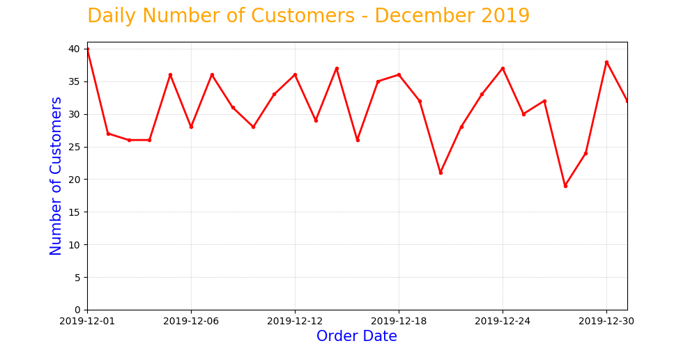

# Pendahuluan

Aku diminta oleh Senja untuk membuat sebuah **_line chart_** dengan menggunakan matplotlib yang menunjukkan jumlah pembeli harian (**_daily number of customers_**) selama bulan Desember.

Setelah mempelajari materi pada modul ini, tentu saja aku pasti bisa menyelesaikan tugas ini dengan baik!

Klik tombol Next untuk mengerjakan permintaan dari Senja.

# Studi Kasus dari Senja: Daily number of customers on Desember

Dengan menggunakan dataset yang sama 
('**https://storage.googleapis.com/dqlab-dataset/retail_raw_reduced.csv**'), 
buatlah sebuah **_line chart_** dengan Matplotlib, yang menunjukkan **jumlah pembeli harian (_daily number of customers_) selama bulan Desember**. 

Beberapa spesifikasi yang harus diperhatikan: 

- Ukuran _figure_ adalah 10x5 
- Sumbu-x adalah tanggal pembelian, dari tanggal 1 - 31 Desember 2019 
- Sumbu-y adalah jumlah _unique customers_ di tiap tanggal 
- _Title_ dan _axis_ label harus ada, tulisan dan _style_-nya silakan disesuaikan sendiri 

Jika berhasil kodenya dibuat dan dijalankan dengan diperoleh grafik seperti berikut ini: 

# Penutup/Kesimpulan

Akhirnya, aku telah selesai mempelajari dasar-dasar pembuatan _chart_ menggunakan matplotlib. Catatan untukku sendiri adalah untuk membuat visualisasi, harus mempersiapkan dulu data yang dibutuhkan. Lalu membuat plot-nya. Selanjutnya, bisa kustomisasi berbagai komponen pada chart, seperti _figure size, title/judul, axis labels, axis ticks, style dari line/points di chart, grid, teks_, dan lain sebagainya. Setelah selesai, tentunya bisa menyimpan gambarnya.

**_Congratulations!_** Aku berhasil menyelesaikan modul **Data Visualization with Python Matplotlib for Beginner - Part 1**. Berdasarkan materi-materi yang telah aku pelajari dan praktikkan dalam modul ini, aku sudah mendapatkan pengetahuan (_knowledge_) dan praktik (_skill_) yang diantaranya:

- mempersiapkan dulu data yang dibutuhkan,
- membuat plot dari data yang telah dipersiapkan,
- mengkustomisasi berbagai komponen di chart yang telah dibuat, seperti figure size, - - title/judul, axis labels, axis ticks, style dari line/points di chart, grid, teks, dan lain sebagainya,
- menyimpan gambar yang telah dibuat.
